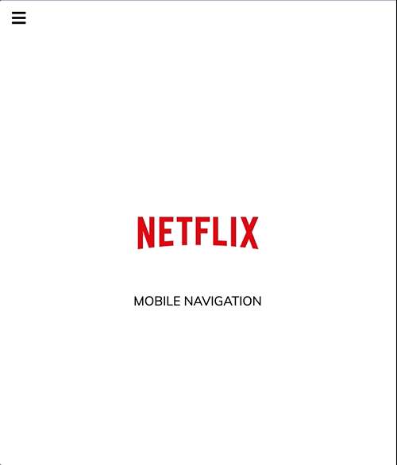

# 🎞️🖥️ Netflix Navigation 

This is a smooth **Netflix-style Navigation Menu** built with **HTML**, **CSS**, and **JavaScript**.  
Click the ‘≡’ menu icon to slide in a stylish sidebar navigation—perfect for a streaming app UI or landing pages!

---

## 🚀 Demo 

<p align="center">
  
</p>

---

## ⭐ Features 
-  Sleek sidebar that toggles with a click  
-  Smooth slide-in animation with overlay effect  
-  Lightweight and mobile-friendly UI  

---

## 🛠️ Technologies Used 
-  HTML  
-  CSS  
-  JavaScript  

---

## 📂 How to Use  
1. 📥 Clone the repository:
   ```bash
   git clone https://github.com/JehanAB/NetflixNavigation-.git
